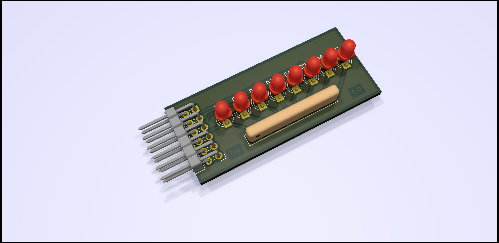

# LED-Pmod

## Table of Contents

- [LED-Pmod](#led-pmod)
  - [Table of Contents](#table-of-contents)
  - [About](#about)
  - [Pinout](#pinout)
  - [History](#history)
  - [Maintainer](#maintainer)

## About

LED-Pmod for for the ZYBO.

## Pinout

| **LED**  | **X1**  |
|:--------:|:-------:|
| D0       | IO1     |
| D1       | IO2     |
| D2       | IO3     |
| D3       | IO4     |
| D4       | IO5     |
| D5       | IO6     |
| D6       | IO7     |
| D7       | IO8     |

## History

| **Version**  | **Description**                            | **Date**   |
|:------------:|:------------------------------------------:|:----------:|
| 1.0          | First release                              | 07.03.2021 |

## Maintainer

- [Daniel Kampert](mailto:DanielKampert@kampis-elektroecke.de)
